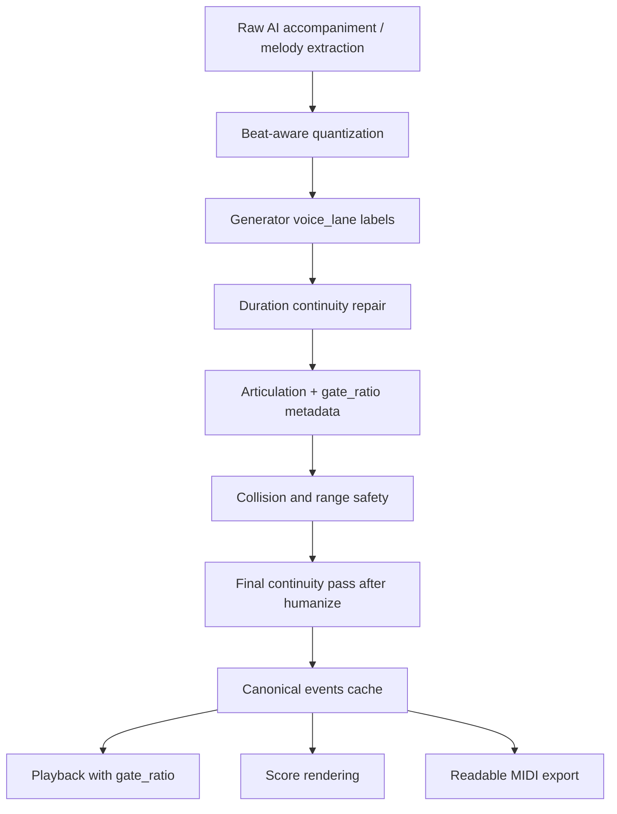

# LiveChord 音符時值連貫性根本改善計劃

> 最終審核版：2026-05-20
> 適用範圍：AI 左手伴奏、AI 右手伴奏、旋律擷取、樂譜顯示、AI 伴奏 MIDI 匯出、和弦塊 MIDI 匯出。

## 審核結論

這個問題是全域性的，不限於 6/8、華爾茲或任何單一節拍。根因在於 AI 事件資料中的 `duration` 同時被用作「音樂時值」與「觸鍵 gate 長度」。一旦伴奏生成器或 dynamics 模組為了做 portato/staccato/human feel 而縮短 `duration`，樂譜與 MIDI 也會被迫輸出短音符與休止符。

本計劃採用根本解：

- `duration` 正式定義為 canonical musical duration，也就是可讀、可彈、可匯出的音樂時值。
- 短促觸鍵改由 `gate_ratio`、`articulation`、envelope metadata 表示。
- AI 伴奏與旋律擷取都接入共用的 beat-aware continuity repair。
- MIDI 匯出第一版只輸出 readable canonical MIDI，不提供 performance gate UI。
- 前端播放必須消費 `gate_ratio`，並加入 release tail 邊界保護，避免破音或聲音混濁。
- ScoreRender 配合 canonical events 支援 meter denominator、dotted duration、tie 與小休止符降噪，但不再承擔根因修補責任。

## 已決策事項

| 問題 | 最終決策 | 理由 |
| --- | --- | --- |
| `gate_ratio` 是否套用到 MIDI export？ | 第一版不套用，不做 UI 開關，只輸出 canonical readable MIDI。 | 使用者主要痛點是 MIDI 匯入 Logic/GarageBand/Synthesia 後碎裂難讀。先解決 90% 場景，未來再加 Performance MIDI 進階選項。 |
| `voice_lane` 由誰標？ | 由 generator 在 emit 階段主動標記。 | 後處理靠 pitch range 或 cluster 推斷 bass / inner / melody 不可靠，cross-voicing 會失敗。 |
| Phase 4 是否同步改 `chord-exporter.js`？ | 必須同步改。 | 同一畫面兩個 MIDI 匯出入口不能輸出不同音長政策。 |
| `ACC_ENGINE_VERSION` bump 後是否全量預熱？ | 預設 lazy generation；可選熱門歌曲 top 50 半預熱，但不作阻斷條件。 | 全量重建成本高；熱門半預熱可降低公眾版首播延遲，其餘歌曲按需重建。 |
| `schema_version` 是否對齊 `ACC_ENGINE_VERSION`？ | 不對齊，schema 獨立版本化，起始值 `2`。 | engine 版本描述音型/模型，schema 描述資料交換格式；旋律擷取也會共用 schema。 |

## 根本問題

### 1. `duration` 被誤用為觸鍵長度

現有事件格式大致是：

```json
{ "time": 1.25, "duration": 0.42, "pitch": 60, "velocity": 80 }
```

但 `duration` 同時被三個系統使用：

- 播放排程：決定 note off。
- 樂譜渲染：決定音符時值與休止符。
- MIDI 匯出：決定 MIDI note-off tick。

因此當後端為了聽感而縮短 `duration`，樂譜與 MIDI 也會跟著變短。

### 2. Pattern 產生器預設留下小空隙

`backend/ai/accompaniment_generator.py` 的 `_emit_period_pattern()` 目前用下一個 pattern onset 推算 event duration，並乘上 `0.9`。這使每個 pattern 音天然留下約 10% gap。

這些 gap 對播放可能只是輕微斷奏，但對樂譜與 MIDI 是實際休止符。

### 3. Dynamics 與 articulation 會再次縮短 duration

`backend/ai/dynamics_engine.py` 的 `_apply_articulation()` 目前直接改 `duration`：

- `staccato` 縮短為 50%。
- `portato` 扣掉約 20ms。
- `legato` 只加 20ms。

這會讓原本可讀的伴奏在後段再次被切短。未來應改成只設定 `articulation` 與 `gate_ratio`。

### 4. 旋律擷取以 voiced/unvoiced frame 切音

`backend/ai/melody_extractor.py` 遇到 unvoiced frame 會立即結束目前音符。後處理目前只合併同 pitch 且小 gap 的片段；不同音之間的短 F0 斷裂會直接變成休止符。

人聲或主旋律在換音時常有短暫 F0 斷裂，這應視為 detection gap，而不是音樂休止。

### 5. ScoreRender 放大資料問題

`frontend/js/score-render.js` 會把事件間任何 gap 轉成 rest。這不是根因，但會把後端小 gap 視覺化成大量休止符。

ScoreRender 仍需支援更正確的 meter、dotted、tie 與小休止符降噪，但根本資料必須先由後端變乾淨。

## 事件 Schema v2

### Top-level schema

伴奏與旋律輸出皆需加入獨立 schema version：

```json
{
  "schema_version": 2,
  "engine_version": "v8",
  "left_hand": [],
  "right_hand": []
}
```

旋律擷取：

```json
{
  "schema_version": 2,
  "melody_version": "v2-continuity",
  "path": "...",
  "melody": []
}
```

`schema_version` 與 `ACC_ENGINE_VERSION` 解耦。未來 engine 可升級到 `v9`、`v10`，只要事件結構不變，schema 仍可維持 `2`。

### Event schema

```json
{
  "time": 1.25,
  "duration": 0.75,
  "pitch": 60,
  "velocity": 80,
  "hand": "right",
  "voice_lane": "rh_acc",
  "articulation": "portato",
  "gate_ratio": 0.86,
  "continuity_meta": {
    "extended_from": 0.42,
    "gap_filled": 0.08,
    "reason": "small-gap-legato"
  }
}
```

欄位語意：

| 欄位 | 語意 |
| --- | --- |
| `duration` | canonical musical duration，供樂譜與 readable MIDI 使用。 |
| `gate_ratio` | 播放端觸鍵比例，預設 `1.0`。 |
| `articulation` | `legato`、`portato`、`staccato`、`muted`、`ghost` 等演奏提示。 |
| `voice_lane` | 由 generator 主動標記的聲部 lane。 |
| `continuity_meta` | 修復紀錄與 shadow/dry-run diff 用。 |

### Voice lanes

建議第一版使用：

```text
lh_bass
lh_inner
lh_chord
rh_acc
rh_melody
rh_chord
string_strum
string_pluck
chord_block
```

規則：

- `accompaniment_generator.py` 在 emit 當下標記 `voice_lane`。
- `note_continuity.py` 只 group by lane，不用猜聲部。
- 若舊 cache 沒有 `voice_lane`，可用防守 fallback，但 fallback 結果不可作為長期 schema。

## 核心資料流



## 核心模組：`note_continuity.py`

新增：

```text
backend/ai/note_continuity.py
```

建議 API：

```python
def repair_note_continuity(
    events: list[dict],
    *,
    bpm: float,
    tempo_curve: list[dict] | None = None,
    time_signature: str = "4/4",
    hand: str = "",
    role: str = "accompaniment",
    chord_boundaries: list[float] | None = None,
    max_gap_beats: float = 0.5,
    dry_run: bool = False,
) -> list[dict]:
    """Return a new repaired event list. The input list is not mutated."""
```

設計要求：

- 純函式：不修改輸入 list，方便測試與 shadow diff。
- beat-aware：gap 門檻依 event onset 的 local BPM 計算；有 `tempo_curve` 時使用 onset 附近 BPM，否則退回 song-level `bpm`。
- lane-aware：只在同一 `voice_lane` 內修復。
- role-aware：melody 可允許跨 chord boundary tie；accompaniment 預設不跨 chord boundary。
- dry-run：只寫 `continuity_meta.would_extend_to` 與 diff 指標，不替換 `duration`。
- articulation 固定保留：`gate_ratio` / `articulation` 永遠只代表 playback touch，不由 continuity core 移除。

### 通用修復規則

1. 同 pitch 小 gap：合併或延長前音。
2. 不同 pitch 小 gap：延長前音到下一音 onset。
3. 大 gap：保留 rest。
4. 明確短促 articulation：保留 `gate_ratio`，但 canonical `duration` 仍可維持可讀。
5. 不跨越下一個同 lane onset。
6. 不跨越下一個 chord boundary，除非 `role="melody"` 或 style 明確允許。
7. 不跨越下一個 `strum_id` 群組邊界。

### `strum_id` 特殊規則

吉他與烏克麗麗事件可能用同一個 `strum_id` 表示一次掃弦。同一 strum 內的 onset 是刻意微幅錯開，用來模擬掃弦。

Continuity 必須把同一 `strum_id` 當作一個群組處理：

- 不逐條 string event 各自延長。
- 同一 strum 的所有音符應共用同一個 canonical end。
- canonical end 以該 strum 最後一個 onset 為基準，再延長到下一個 lane onset 或下一個 strum 邊界前。
- 不跨越下一個 `strum_id`。
- 視覺上同一掃弦應整隊結束在同一條線，避免參差不齊。

## 伴奏生成改善

### Pattern sustain policy

`_emit_period_pattern()` 不應固定乘 `0.9`。改由 style 宣告 sustain policy：

```python
SUSTAIN_TO_NEXT = "to_next_onset"
SUSTAIN_TO_BEAT = "to_beat"
SUSTAIN_TO_CHORD_END = "to_chord_end"
SUSTAIN_GATE_ONLY = "gate_only"
```

style config 範例：

```python
"Arpeggio": {
    "sustain_policy": "to_next_onset",
    "gate_ratio": 0.92
}
```

`duration` 代表音樂時值；播放短促感由 `gate_ratio` 表現。

### `_build_fill_notes` 職責邊界

`_build_fill_notes()` 保留，但只負責「在 RH 人聲空白處創造 fill notes」。Continuity 只負責「延長、合併或清理既有 events」。

建議順序：

```text
emit base pattern
→ _build_fill_notes creates optional fills
→ hand collision / range safety
→ fingering
→ dynamics metadata
→ humanize onset
→ final continuity repair
→ cache
```

### Dynamics 改為 metadata

`dynamics_engine.py` 不再縮短 `duration`：

```json
{ "articulation": "portato", "gate_ratio": 0.90 }
{ "articulation": "staccato", "gate_ratio": 0.55 }
{ "articulation": "legato", "gate_ratio": 1.00 }
```

若 `gate_ratio > 1.0` 可能造成 overlap，第一版建議 clamp 到 `1.0`，legato 聽感由 envelope 或 pedal 表現，避免播放與 MIDI 語意混亂。

### Cache version

伴奏事件語意變更後需要：

```python
ACC_ENGINE_VERSION = "v8"
```

並在結果 JSON 加：

```json
{ "schema_version": 2, "engine_version": "v8" }
```

## 前端 Playback：`gate_ratio` 防破音設計

`player.js` 必須消費 `gate_ratio`，否則原本靠縮短 `duration` 形成的 staccato/portato 聽感會消失。

但 `gate_ratio` 不能天真套用，必須限制 release tail 不溢出 canonical duration 邊界，避免快速音型中 Web Audio node 疊太多、產生 click 或混濁。

建議播放端邏輯：

```javascript
const gate = Number.isFinite(evt.gate_ratio) ? evt.gate_ratio : 1.0;
const releaseTail = 0.15;
const canonicalEnd = startTime + duration;
let audioOff = startTime + duration * Math.max(0.05, Math.min(gate, 1.0));

if (audioOff + releaseTail > canonicalEnd) {
  audioOff = Math.max(startTime, canonicalEnd - releaseTail);
}

source.stop(audioOff + releaseTail);
```

實作注意：

- Scheduler 需要把整個 event 或 `gate_ratio` 傳進 `SampleSynth.playNote()`。
- oscillator fallback 與 sample playback 都要套用同一 gate policy。
- `source.stop()` 可有 release tail，但 gain envelope 必須在 `audioOff` 後淡出，避免 hard stop click。
- staccato 視覺化仍讀 `articulation`，瀑布條長度改長是預期變更，因為瀑布條代表 canonical musical duration。

## 旋律擷取改善

### V1 pYIN

在 `MelodyExtractor._post_process()` 後接 `repair_note_continuity()`：

- 同 pitch 小 gap：merge。
- 不同 pitch 小 gap：延長前音到下一音。
- 低 confidence 短裝飾音：若 duration 小於 1/16 且前後音穩定，吸收到鄰近音或標記 grace。
- 長 silence 才保留 rest。
- melody 不強制依賴 chord boundaries；`chord_boundaries=None` 是合法輸入。

### V2 / Basic Pitch

V2 也必須共用同一個 `note_continuity.py`：

```text
basic-pitch events
→ monophonic lane selection
→ short-note pruning
→ repair_note_continuity(role="melody")
→ schema_version=2 cache
```

這避免 V1/V2 有兩套不同的修復邏輯。

## MIDI 匯出改善

第一版決策：MIDI export 只輸出 canonical readable MIDI，不套用 `gate_ratio`，不做 UI 開關。

需要同步處理兩個入口：

- `frontend/js/midi-exporter.js`：AI 伴奏 MIDI。
- `frontend/js/chord-exporter.js`：和弦塊 PDF/MIDI 的 `_voiceChordToMidi`。

未來若有專業使用者需要保留演奏 gate，可新增進階選項：

```text
[ ] 匯出動態演奏長度 (Performance MIDI)
```

但這不是第一版範圍。

## ScoreRender 改善

ScoreRender 不再作為根因修復點，但必須正確呈現 canonical events。

### VexFlow 實作要點

- `6/8` 必須使用 `num_beats=6, beat_value=8`，不可再只取分子當 quarter beats。
- dotted quarter、dotted half 等 duration 需要納入 quantization。
- tie 在 VexFlow 不是 note 屬性，而是獨立渲染物件：`new Vex.Flow.StaveTie(...)`。
- 跨小節長音必須在 parser 層拆成多個 `StaveNote`，再建立 tie objects。
- Voice duration 必須等於該小節 beats，否則會觸發 RhythmException。
- 既有 Padding Patch 要改成支援非 4/4 quarter grid。

### Phase 4 拆分

- 4a：meter denominator 正確 + dotted duration + Padding Patch 更新。
- 4b：tie 狀態機，含跨小節與同小節 chained tie。
- 4c：小 rest 視覺降噪 + `chord-exporter.js` MIDI policy 對齊。

## 全節拍通用規則

此改善必須對所有 meter 生效，不只 6/8。

| Meter | 預設 gap fill threshold | 備註 |
| --- | --- | --- |
| 4/4 | 1/8 note | pop、ballad、rock 通用。 |
| 3/4 | 1/8 note | waltz 需避免碎休止。 |
| 6/8 | 1 eighth subdivision | 3+3 phrasing，常用 dotted quarter。 |
| 12/8 | 1 eighth subdivision | shuffle / slow blues。 |
| unknown | min(0.25s, half beat) | 防守型 fallback。 |

例外只由 style / articulation 明確宣告，不由短 `duration` 暗示。

## 驗收指標

### 1. Small Rest Density

每 4 小節內，小於等於 1/8 note 的 rest 數量應接近 0。明確 staccato/muted/ghost 例外需另計。

### 2. Continuity Coverage

同一 phrase 內：

```text
coverage = total_note_duration / (phrase_end - phrase_start)
```

目標：

- melody：per phrase >= 0.85，排除超過 2 秒的段間 silence。
- LH accompaniment：>= 0.80。
- RH accompaniment：>= 0.75。

不使用整首歌 `(last_note_end - first_note_start)` 當 melody 分母，避免間奏或段間 silence 造成誤判。

### 3. Fragment Alternation Count

偵測：

```text
note short-rest note short-rest note
```

同一小節內不應大量出現。

### 4. MIDI Note-Off Readability

匯出後用 MIDI parser 讀回，檢查同 lane 小 note-off gap 數量。Readable MIDI 不應大量出現短 gap。

### 5. Intentional Articulation Preservation

Funk16、muted stab、明確 staccato 測試必須保留短 gate_ratio 聽感，但 canonical duration 仍保持可讀。

### 6. VexFlow Stability

ScoreRender 必須在 4/4、3/4、6/8、12/8、跨小節 tie、dotted durations 下不觸發 RhythmException。

## 實作時程

### Phase 0：規範化與文件先行

交付：

- 將 event schema v2、canonical duration、`gate_ratio`、`voice_lane`、`schema_version` 寫入 CLAUDE.md 或 project spec。
- 明確定義 readable MIDI 是第一版唯一匯出政策。
- 更新 implementation issue 的 acceptance criteria。

### Phase 1：Continuity Core

交付：

- 新增 `backend/ai/note_continuity.py`。
- 單元測試涵蓋 4/4、3/4、6/8、12/8、unknown meter。
- 測試 `strum_id` 群組、humanize 後微 gap、melody phrase silence、staccato gate preservation。
- dry-run 模式輸出 diff meta。

### Phase 2：後端伴奏接入與前端播放消費

交付：

- `accompaniment_generator.py` emit 階段標 `voice_lane`。
- `_emit_period_pattern()` 移除固定 `0.9`，改 sustain policy。
- `_build_fill_notes` 保留為 fill note creation，continuity 只修既有 notes。
- `dynamics_engine.py` 改寫 `gate_ratio`，不縮短 `duration`。
- `player.js` 消費 `gate_ratio`，並加入 release tail 邊界保護。
- bump `ACC_ENGINE_VERSION` 到 `v8`。

### Phase 2.5：Shadow 灰度觀測

交付：

- production/personal 環境先跑 continuity dry-run，不替換 events。
- 寫入 `continuity_meta.would_extend_to` 與統計 log。
- 至少觀測一週或一批代表曲，確認沒有 overlap bug、和聲糊化、strum 群組錯延長。
- 以 feature flag 切換正式啟用。

### Phase 3：Melody 擷取對齊

交付：

- V1 pYIN 後處理接 `note_continuity.py`。
- V2 Basic Pitch 後處理共用同一模組。
- melody cache 加 `schema_version=2` 與 `melody_version`。
- 舊 cache lazy regenerate 或相容讀取。

### Phase 4：前端渲染與雙 MIDI 匯出

交付：

- 4a：ScoreRender meter denominator + dotted support + Padding Patch 更新。
- 4b：ScoreRender tie 狀態機。
- 4c：rest 視覺降噪、`midi-exporter.js` readable MIDI、`chord-exporter.js` readable MIDI。
- Playwright 驗證 score 不空白、不 crash、不重疊。

### Phase 5：快取滾動清理與驗收

交付：

- NUC personal：lazy regenerate。
- VPS public：預設 lazy regenerate；部署時可對熱門歌曲 top 50 做背景半預熱。
- 10 首代表曲風 A/B 聽測：4/4 ballad、3/4 waltz、6/8、12/8 shuffle、funk/staccato、string strum。
- high-rated songs 回歸聽測，避免視覺改善造成已評高歌曲退化。

## 風險與防護

| 風險 | 防護 |
| --- | --- |
| 過度延長造成和聲糊化 | lane-aware、chord boundary、shadow dry-run、A/B 聽測。 |
| staccato/funk 失去短促聽感 | `gate_ratio` + player.js release-tail bounded playback。 |
| string strum 被拆散 | `strum_id` group-as-one，整隊同 end，不跨下一 strum。 |
| humanize 後又出現 gap | final continuity 放在 humanize 後。 |
| 舊 cache 污染 | `ACC_ENGINE_VERSION=v8`、`schema_version=2`、lazy regenerate。 |
| VexFlow crash | Phase 4 拆 4a/4b/4c，逐步驗證 Voice duration equality。 |
| 公眾版首播 latency | lazy generation + top 50 semi-preheat + 前端友善提示。 |

## 使用者提示文案

若 v8 cache 首次生成需要等待，前端可顯示：

```text
AI 正在重新編排曲譜連貫性...
```

這比「重新產生伴奏」更貼近使用者看到的改善。

## 關鍵檔案

- `backend/ai/accompaniment_generator.py`
- `backend/ai/dynamics_engine.py`
- `backend/ai/melody_extractor.py`
- `backend/ai/melody_extractor_v2.py`
- `backend/ai/note_continuity.py`
- `backend/ai_api.py`
- `backend/process_queue.py`
- `frontend/js/player.js`
- `frontend/js/midi-exporter.js`
- `frontend/js/chord-exporter.js`
- `frontend/js/score-render.js`
- `frontend/player.html`
- `CLAUDE.md` or project spec file for schema v2

## 最終交付判定

此計劃可進入 Phase 0 / Phase 1 實作。動工前不再保留 open questions；五個關鍵問題已在本文件中決策完成。

第一個實作 PR 建議只做 Phase 0 + Phase 1，確保 schema 與 continuity core 穩定；第二個 PR 再接 Phase 2 與 player playback，並立刻開 Phase 2.5 shadow 觀測。
