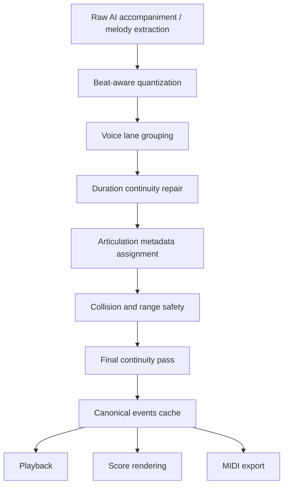

# LiveChord 音符時值連貫性根本改善計劃

## 背景

目前 LiveChord 的 AI 左手伴奏、右手伴奏與旋律擷取，會在樂譜與匯出 MIDI 中出現共同問題：

- 音符時值偏短。
- 小空隙被表現成大量休止符。
- 同一聲部呈現「音符、休止、音符、休止」的碎裂感。
- 慢板、6/8、華爾茲、流行、古典等不同節拍都可能發生，因此不能只針對 6/8 或前端樂譜渲染修補。

這份計劃的目標是從 AI 事件資料本身修正，使播放、樂譜顯示、MIDI 匯出都共享同一份連貫的音樂時值。

## 根本問題

### 1. duration 被誤用為觸鍵長度

現有事件格式大致是：

```json
{ "time": 1.25, "duration": 0.42, "pitch": 60, "velocity": 80 }
```

但 `duration` 同時被三個系統使用：

- 播放排程：決定 note off。
- 樂譜渲染：決定音符時值與休止符。
- MIDI 匯出：決定 MIDI note-off tick。

因此伴奏生成器為了做出 portato、staccato、human feel 而縮短 duration 時，樂譜與 MIDI 也一起變短，形成不必要休止符。這是根本結構問題。

### 2. Pattern 產生器預設留下小空隙

`backend/ai/accompaniment_generator.py` 的 `_emit_period_pattern()` 會用下一個 pattern onset 推算 event duration，並乘上 `0.9`。這表示即使音型本來應該連續，每個音之間也會天然留下 10% gap。

這些 gap 對音訊播放可能只是輕微斷奏，但對樂譜與 MIDI 是實際休止符。

### 3. Dynamics 與 articulation 會再次縮短 duration

`backend/ai/dynamics_engine.py` 目前在 `_apply_articulation()` 裡會直接修改 `duration`：

- `staccato` 縮短為 50%。
- `portato` 扣掉約 20ms。
- `legato` 只加 20ms。

這使伴奏即使原本可讀，也可能在後段被再次切短。

### 4. 旋律擷取以 voiced/unvoiced frame 切音

`backend/ai/melody_extractor.py` 遇到 unvoiced frame 會立即結束目前音符。後處理目前只合併「同音且 gap 小於 `gap_merge`」的片段；不同音之間的小空隙不會被補滿。

人聲或主旋律中，音高轉換時常會有非常短的 F0 斷裂。這些斷裂不應直接變成休止符。

### 5. 前端 ScoreRender 放大了資料問題

`frontend/js/score-render.js` 會把事件間任何 gap 轉成 rest。這不是根因，但會把後端小 gap 視覺化成大量休止符。

所以前端仍需要正確處理 ties、dotted duration、meter denominator，但最重要的是後端事件先變乾淨。

## 設計原則

### Canonical duration 代表音樂時值

事件中的 `duration` 應代表音樂上持續到哪裡，而不是短促觸鍵長度。

若需要短促演奏，使用額外欄位描述：

```json
{
  "time": 1.25,
  "duration": 0.75,
  "pitch": 60,
  "velocity": 80,
  "articulation": "portato",
  "gate_ratio": 0.86
}
```

規則：

- 樂譜使用 `duration`。
- MIDI 匯出預設使用 `duration`。
- Web Audio 播放可用 `gate_ratio` 或 envelope 模擬短促觸鍵。
- 只有明確標記為 staccato、muted、percussive 的事件，才允許 exported MIDI 使用較短 gate。

### 最長時值優先

同一聲部內，若音符 A 結束與音符 B 開始之間的 gap 小於等於門檻，直接延長 A 到 B 的開始。

門檻不是固定秒數，而是 beat-aware：

- 一般預設：小於等於 1/8 note。
- 慢板：可放寬到 1/8 note 或 300ms 的較小值。
- 快速音型：避免吞掉 intentional articulation，可限制為 1/16 到 1/8 note。
- 同 pitch：更積極合併或 tie。

### 碎休止符預設視為雜訊

除非事件帶有明確 articulation：

- `staccato`
- `muted`
- `ghost`
- `percussive`
- `breath`

否則同聲部中的短 rest 不應出現在 canonical event stream。

### 根據聲部分組修正，不跨聲部亂延長

Continuity pass 必須先分聲部：

- 左手低音線。
- 左手和聲內聲部。
- 右手伴奏。
- 右手旋律。
- 同 onset chord block。

避免把不同音區、不同功能的事件互相延長，造成不合理 overlap。

## 目標資料流



重點是 `Canonical events cache` 之後，播放、樂譜、MIDI 不再各自猜 duration。

## 新增核心模組

建議新增：

```text
backend/ai/note_continuity.py
```

核心 API：

```python
def repair_note_continuity(
    events: list[dict],
    *,
    bpm: float,
    tempo_curve: list[dict] | None = None,
    time_signature: str = "4/4",
    hand: str = "",
    role: str = "accompaniment",
    chord_boundaries: list[float] | None = None,
    max_gap_beats: float = 0.5,
    preserve_articulations: bool = True,
) -> list[dict]:
    ...
```

主要責任：

- 依 local beat duration 計算 gap。
- 同聲部小 gap 延長前音。
- 同 pitch 小 gap 合併。
- 相鄰不同 pitch 小 gap 延長前音到下一音開始。
- 避免跨越下一個同聲部 onset。
- 避免不合理跨越 chord boundary，除非 style 或 melody role 允許 tie。
- 將修正紀錄寫入 `continuity_meta`，方便 debug。

輸出範例：

```json
{
  "time": 1.0,
  "duration": 0.5,
  "pitch": 67,
  "velocity": 82,
  "hand": "right",
  "continuity_meta": {
    "extended_from": 0.42,
    "gap_filled": 0.08,
    "reason": "small-gap-legato"
  }
}
```

## 伴奏生成改善

### Phase A：移除 pattern 層的預設短音

目前 `_emit_period_pattern()` 使用 `event_dur * 0.9`。需改成 sustain policy：

```python
SUSTAIN_TO_NEXT = "to_next_onset"
SUSTAIN_TO_BEAT = "to_beat"
SUSTAIN_TO_CHORD_END = "to_chord_end"
SUSTAIN_GATE_ONLY = "gate_only"
```

每個 style 可以定義：

```python
"Arpeggio": {
    "sustain_policy": "to_next_onset",
    "gate_ratio": 0.92
}
```

這樣 event duration 保持連貫，播放端若要輕微分離，用 `gate_ratio` 處理。

### Phase B：重構 Dynamics Engine

`generate_dynamics()` 不應直接縮短 `duration`。改成：

- 設定 `articulation`。
- 設定 `gate_ratio`。
- 設定 `attack/release` 或 `envelope_hint`。

例如：

```json
{ "articulation": "portato", "gate_ratio": 0.9 }
{ "articulation": "staccato", "gate_ratio": 0.55 }
{ "articulation": "legato", "gate_ratio": 1.02 }
```

### Phase C：在 generate_accompaniment() 末端做 final continuity

建議順序：

```text
raw pattern events
→ hand collision / range safety
→ fingering
→ dynamics metadata
→ humanize onset
→ final continuity repair
→ sort and cache
```

原因：

- humanize 會微移 onset，可能重新製造小 gap。
- collision filter 可能刪除事件，也可能製造 gap。
- final continuity 必須在最後保證輸出資料乾淨。

### Phase D：cache version bump

伴奏事件語意改變後必須 bump：

```python
ACC_ENGINE_VERSION = "v8"
```

否則舊 cache 會繼續輸出短 duration。

## 旋律擷取改善

### Melody V1

在 `MelodyExtractor._post_process()` 後新增 beat-aware continuity pass：

- 同音短 gap：merge。
- 不同音短 gap：延長前音到下一音開始。
- 低 confidence 短裝飾音：若 duration 小於 1/16 且前後音穩定，吸收到鄰近音或標記 grace。
- 長 silence 才保留 rest。

旋律輸出需要新增 schema metadata：

```json
{
  "path": "...",
  "melody_version": "v2-continuity",
  "melody": [...]
}
```

### Melody V2 / Basic Pitch

Basic Pitch shadow/V2 輸出 notes 數量偏高的既有問題，也應套用同一個 `note_continuity.py`，不要讓 V1/V2 各自有不同修復邏輯。

V2 額外需要：

- 先做 monophonic lane selection。
- 再做 continuity repair。
- 最後再做 short-note pruning。

## MIDI 匯出改善

目前 `frontend/js/midi-exporter.js` 直接用 `e.duration` 產生 note-off。因此後端 canonical duration 修好後，MIDI 會直接改善。

但仍建議加一個明確策略：

- 預設匯出 `duration`，代表可讀、可彈的音樂時值。
- 若未來需要「performance MIDI」，可選擇套用 `gate_ratio`。
- 使用者目前的 AI 伴奏 MIDI 下載應走 readable MIDI，不使用碎短 gate。

## 樂譜渲染改善

前端不是根因，但需要配合 canonical events：

- 正確處理 `time_signature` denominator，例如 `6/8` 應是 `num_beats=6, beat_value=8`。
- 支援 dotted quarter、dotted half。
- 支援跨小節 tie。
- 對小於 threshold 的 rest 做視覺降噪，不再貪婪輸出 16/32 rests。
- 若後端事件已有 `continuity_meta`，前端不再二次猜測修正。

## 全節拍通用規則

此改善不能只套 6/8，需對所有 meter 生效：

| Meter | 預設 gap fill threshold | 備註 |
| --- | --- | --- |
| 4/4 | 1/8 note | pop、ballad、rock 通用 |
| 3/4 | 1/8 note | waltz 需避免碎休止 |
| 6/8 | 1 eighth subdivision | 3+3 phrasing，常用 dotted quarter |
| 12/8 | 1 eighth subdivision | shuffle / slow blues |
| unknown | min(0.25s, half beat) | 防守型 fallback |

例外只由 style/articulation 明確宣告，而不是由短 duration 暗示。

## 測試與驗收指標

新增測試檔：

```text
backend/tests/test_note_continuity.py
backend/tests/test_accompaniment_continuity.py
backend/tests/test_melody_continuity.py
```

### 指標 1：Small Rest Density

每 4 小節內，小於等於 1/8 note 的 rest 數量應接近 0。

### 指標 2：Continuity Coverage

同一聲部 active span 內：

```text
coverage = total_note_duration / (last_note_end - first_note_start)
```

一般 legato/伴奏聲部目標：

- melody：>= 0.85，除非長休止。
- LH accompaniment：>= 0.80。
- RH accompaniment：>= 0.75。

### 指標 3：Fragment Alternation Count

偵測：

```text
note short-rest note short-rest note
```

同一小節內不應大量出現。超過門檻即 fail。

### 指標 4：MIDI Note-Off Readability

匯出的 MIDI 重新讀回後，短 note-off gap 不應大量存在。這可直接避免「MIDI 匯出仍碎」。

### 指標 5：Intentional Staccato Preservation

Funk16、muted stab、明確 staccato 測試必須保留短 gate，但 canonical duration 仍需可被樂譜解讀，不應無限制產生休止符。

## 實作分期

### Phase 1：建立 continuity core

交付：

- 新增 `backend/ai/note_continuity.py`。
- 新增 synthetic tests。
- 不接 production，只驗證演算法。

### Phase 2：接入伴奏生成

交付：

- `generate_accompaniment()` 末端套用 final continuity。
- `dynamics_engine.py` 改用 `gate_ratio`，不直接縮短 `duration`。
- `_emit_period_pattern()` 改 sustain policy。
- bump `ACC_ENGINE_VERSION`。

### Phase 3：接入旋律擷取

交付：

- V1 melody post-process 加 beat-aware continuity。
- V2/basic-pitch 後處理共用同一模組。
- melody cache 加 version metadata。

### Phase 4：MIDI 與 ScoreRender 對齊

交付：

- MIDI export 預設使用 readable canonical duration。
- ScoreRender 支援 meter denominator、dotted duration、tie。
- 小 rest 視覺降噪只作保險，不作主要修正。

### Phase 5：資料回填與 QA

交付：

- 清理或重建舊 accompaniment cache。
- 針對 representative songs 做 batch audit。
- 加入 quality gate，避免未來再輸出碎音事件。

## 風險與防護

### 風險：過度延長造成和聲糊掉

防護：

- 不跨越下一個同聲部 onset。
- 預設不跨越 chord boundary，除非 melody role 或 sustain style 允許。
- 對低音聲部與和聲聲部分 lane 修正。

### 風險：staccato / funk 類型被修成太連

防護：

- style 明確宣告 `preserve_short_gate=True`。
- 使用 `gate_ratio` 表現短促，而不是讓 canonical duration 短掉。

### 風險：humanize 後又產生微 gap

防護：

- final continuity pass 放在 humanize 後。
- 對 humanize shift 後的 onset 重新計算 duration。

### 風險：舊 cache 污染結果

防護：

- accompaniment bump `ACC_ENGINE_VERSION`。
- melody cache 加 `melody_version`。
- API 偵測舊 schema 時可 lazy regenerate。

## 建議審查重點

審查時建議先確認三個決策：

1. `duration` 是否正式定義為「音樂持續時值」，而非短促觸鍵長度。
2. Web Audio 播放是否接受改用 `gate_ratio` 表現 portato/staccato。
3. MIDI 匯出是否預設輸出 readable MIDI，而不是 performance-gated MIDI。

只要這三點確認，後續實作可以分階段推進，而且能從根本同時改善伴奏、旋律、樂譜與 MIDI。
